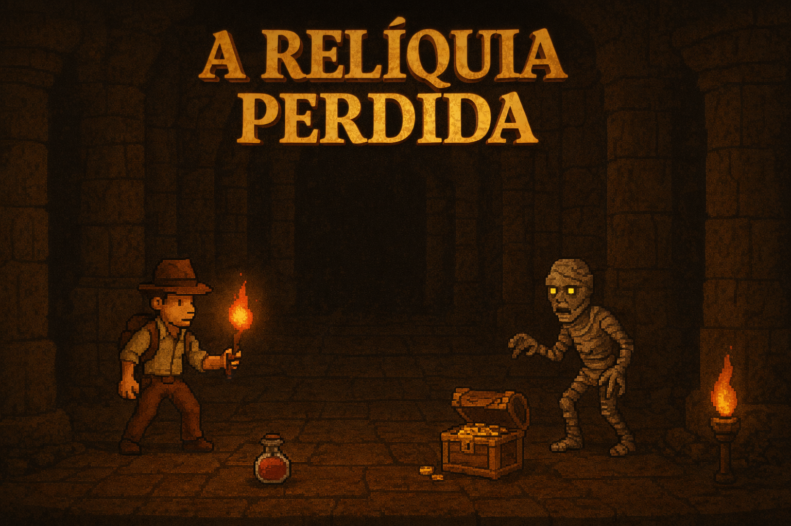

# A Relíquia Perdida

### Projeto
Um jogo pixelart de aventura e exploração inspirado em ToeJam & Earl, com caracteristicas roguelike e ambientado em um universo de arqueologia no estilo Indiana Jones.

## Objetivo
A Relíquia Perdida é um jogo pixelart de exploração em que o personagem principal é um explorador de ruínas antigas, que tem como objetivo encontrar três relíquias perdidas. A experiência é estruturada em níveis, cada um com inimigos, armadilhas e itens distribuidos aleatoriamente, incentivando a exploração constante do mapa. O jogador deve localizar saídas escondidas para progredir, enfrentando inimigos como múmias, dançarinas hipnóticas e obstáculos. Durante a jornada, itens como estatuetas de cura, bússolas e tochas auxiliarão na sobrevivência e descoberta de segredos. 

### Diferencial
A parte especial do está na aleatoriedade de inimigos, itens e armadilhas com efeitos únicos no usuário, fazendo com que o jogo incentive muito sua rejogabilidade.

## Níveis
Nesse protótipo serão implementados três níveis. 

### Pontuação
A pontuação é baseada no tempo final em que o jogador consegue coletar todas as relíquias e concluir os níveis.

### Artefatos
São itens com efeitos diversos, desconhecidos até o primeiro uso.

* `Tocha:` Aumenta o campo de visão do personagem;
* `Cálice:` Concede uma vida extra para o personagem;
* `Estatueta de Cura:` O personagem recupera 40 de vida (Esse artefato aparece mais vezes no mapa);
* `Bússola:` Mostra a localização da relíquia em relaçã á posição atual do personagem (Norte, Sul, Leste, Oeste, etc.);

### Relíquias
Para zerar o jogo, as três relíquias devem ser coletadas. Eles serão colocadas aleatoriamente pelas áreas, cada área possui uma relíquia.

Detalhes serão adicionados ou modificados no decorrer do desenvolvimento do jogo conforme o grupo for verificando a viabilidade da implementação das mecânicas idealizadas.
